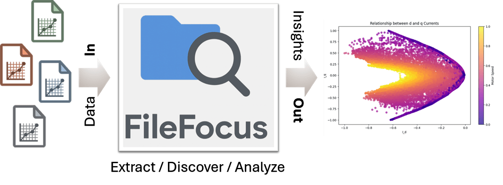
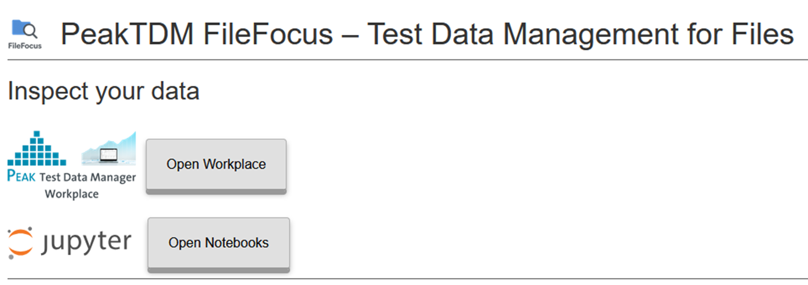

# PeakTDM FileFocus



**The Fastest Way to Turn Test & Measurement Files Into AI‑Ready Data**

Peak Test Data Manager (PeakTDM) **FileFocus** is the fastest way to transform your scattered test and measurement files into a unified, searchable, AI-ready data platform - *without disrupting your existing toolchains*.

## Quick Start Guide

The guide helps you get started with *PeakTDM FileFocus*.

### Requirements

*PeakTDM FileFocus* is delivered as a Docker container and requires a working Docker runtime.
On Windows, install Docker Desktop[^1].

Log in to the Peak Solution Docker Image Repository[^2]:

``` bash
docker login https://docker.peak-solution.de
```

ℹ️ If Docker containers cannot be used in your organization, please [contact Peak Solution](https://www.peak-solution.de/contact.html) for alternatives.

As a single-server installation we recommend the following system requirements: **8 CPU cores**, **32 GB RAM** - for the Docker Desktop virtualization environment we recommend using WSL 2[^1]. 


### Install *PeakTDM FileFocus*

Clone or [download](https://github.com/peak-solution/filefocus/archive/refs/heads/main.zip) this repository.

⚠️ **Note: By downloading or installing the Software, you acknowledge that you have read and understood the [End User License Agreement](Eula_FileFocus_Discovery_Package.pdf) and agree to be bound by its terms.**

If downloaded as a ZIP, extract the archive to a local folder.
Copy your license file into the `.\license` folder of your installation, see [Licensing](#licensing).

### Start *PeakTDM FileFocus*

Open a terminal (cmd) and navigate to the repository folder and start the FileFocus environment:

``` bash
docker compose up -d
```

If you want to use *PeakTDM FileFocus* **with example files** use the following command instead 

```bash
docker compose --profile examples up -d
```

or copy your own data files to the `./datafolder` in your installation directory.

Your *PeakTDM FileFocus* instance is now up and running.

## Usage and Examples

### Verify the installation

By default *PeakTDM FileFocus* runs on port 15000.

Copy the following URL into your browser to access the *PeakTDM FileFocus* Web UI:

👉 http://localhost:15000



You can now use the following components:

🟩 **Apache Airflow and ExD DataPlugins** for data import and enrichment

🟧 **PeakTDM Test Data Workplace** to find and inspect your data

🟦 **Jupyter Notebooks** for data access and analysis using Python

### Configure *PeakTDM FileFocus*

Copy the `.env.example` file to `.env`, open it in a text editor and adjust the values according to your setup.

Set the `DATAFOLDER` variable to the absolute path of your data files to index your specific file location. To apply the configuration settings, **restart** the *PeakTDM FileFocus* environment by executing the following commands:

``` bash
docker compose down -v
```

and then

``` bash
docker compose up -d
```

⚠️ Note: Docker on Windows cannot use UNC paths directly - you need to use the cifs driver for network shares. See `.env.example` file for examples.

### Import Your Own Data Files

*PeakTDM FileFocus* can deal with almost any measurement file format. In case your file format is not supported yet, you can develop your own **ExD data plugin**.

👉 Visit the [Data Management Learning Path](https://peak-solution.github.io/data_management_learning_path/exd_api/overview.html) for instructions and examples or [contact Peak Solution](https://www.peak-solution.de/contact.html).

### Python API

Access your data programmatically via Python using [Peak ASAM ODSBox](https://peak-solution.github.io/odsbox/) - a thin wrapper around the *PeakTDM FileFocus* HTTP(S)-APIs.

👉 Find more Python examples in the [Data Management Learning Path](https://peak-solution.github.io/data_management_learning_path/.)

## Licensing

Running *PeakTDM FileFocus* requires a valid license issued by Peak Solution.
Need an **evaluation license**:

👉 [Contact Peak Solution](https://www.peak-solution.de/contact.html).

## Roadmap

As the fastest way to turn test & measurement files into AI‑ready data,
we are actively exploring the use of PeakTDM data with **agentic AI frameworks**.

👉 [Read the blog](https://www.peak-solution.de/testdatamanagement/test-and-measurement-data-management-in-the-age-of-ai.html#a12690) or [contact Peak Solution](https://www.peak-solution.de/contact.html) to learn how your data can be used with Github Copilot and other agentic tools.

## Contact

For questions about *PeakTDM FileFocus* or other Peak Solution products feel free to

👉 [Reach out to Peak Solution](https://www.peak-solution.de/contact.html)

Explore the *PeakTDM FileFocus* website for more information:

👉 [PeakTDM FileFocus](https://www.peak-solution.de/products/testdatamanagement/filefocus.html)

## Footnotes

[^1]: You can find the Docker Desktop installation instructions on the official Docker web site: [Get Docker Documentation](https://docs.docker.com/get-docker/) See also the  [requirements for WSL](https://docs.docker.com/desktop/setup/install/windows-install/) which also includes the Docker Desktop licensing conditions.

[^2]: You need login credentials for the Peak Solution Docker Image Repository. In case you don't have them, please [contact Peak Solution](https://www.peak-solution.de/contact.html)
