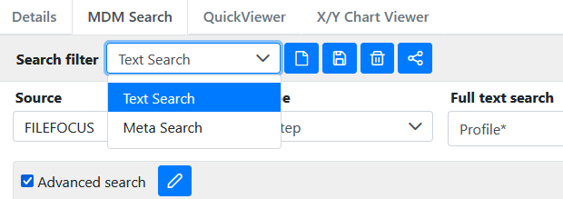
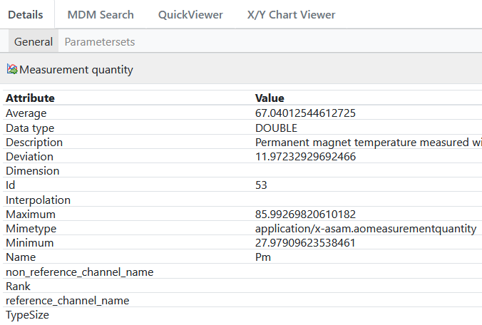
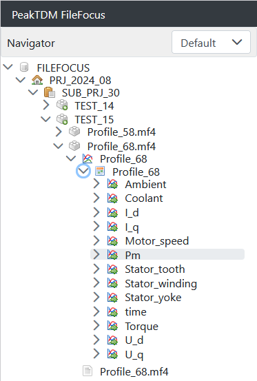

## 🟧 Find and Inspect

Use *PeakTDM Workplace* to find and inspect your data.

In *PeakTDM Workplace* you can 
* Search for Data 
* Display Channel Data
* Explore the Meta Data
* Navigate Data

💡 Hint 1:  We suggest using the searching experience over navigation. Given the tree is reflecting the data different than your folder structure, searching is in most cases the more intuitive and faster way to find what you're looking for.

💡 Hint 2: In *PeakTDM Workplace* click on **>>About>>User Guide** to find a more detailed help.

| Search Data |   |
| ----- | ----- |
|  | Use MDM Search to find files and data indexed by *PeakTDM FileFocus*. Use the **Text Search** for full-text searching. Right-click **Results** to **Add to chart viewer** for inspection or **Show in tree**  |

| Explore the Meta Data |   |
| ----- | ----- |
|  |  When selecting an item in the navigation tree, you can inspect the meta of that item. You can find in addition to the **Name** also details like **Description** or for data channels characteristics like **Minimum**, **Maximum**, **Average** and (standard) **Deviation**.  At **Parametersets** you can find additional descriptive data on the **Measurement** level. |

| Navigate Data |   |
| ----- | ----- |
|  |  In the navigation tree you can browse your data files. However, your folder hierarchy structure is mapped onto the three data organization levels: **Project**, **Subproject** and **Test**. At the following **Teststep** level you will find your files. When opening the file, you can access the data stored inside the file - you've reached the **Measurement** level. Right-click on measurements and **Add to chart viewer** for data inspection. Right-click on the file to **Download file**.  |
