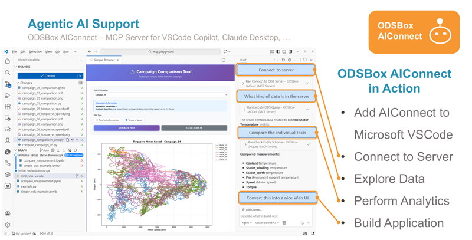

# MCP Playground

Open this folder in VSCode to interact with an ASAM ODS server using Microsoft Copilot in combination with the ODSBox Python library, and the ODSBox Jaquel MCP Service - **ODSBox AIConnect**.

## Install Prerequisites 

To use *ODSBox AIConnect* with Microsoft Visual Studio Code (VSCode) we recommend to have the following tools and applications installed:

* VSCode
* UV
* Python
* Git

The easiest way to get those installed is by using winget in CMD window (type `cmd` in windows command line) like shown below:

``` bash
winget install astral-sh.uv
winget install Python.Python.3.13
winget install Git.Git
winget install Microsoft.VisualStudioCode
```

Close the cmd window. Now `python`, `uvx`, `git`, `code` should be on path.
If it is not available Log out from Windows and Log in again.

## Using with VSCode Copilot Chat

You can now start working with *ODSBox AIConnect*. Open the Copilot Chat window in VSCode and start asking questions about ASAM ODS, ODSBox, or how to use the MCP Service. You can also ask for code snippets to interact with the MCP Service. See the example for example prompts to retrieve some information from an ASAM ODS server.


